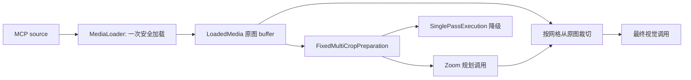

# VisionKit MCP 期4专项设计：Agentic Zoom

> 状态：已评审并完成核心实现；真实效果对照待执行
> 日期：2026-07-12
> 关联：总设计第 5、6 节；期3专项设计

## 1. 目标、范围与非目标

期4在不改变现有七个 MCP 工具输入/输出契约的前提下，为小字、局部 UI、图表和技术图增加可选的动态放大路径。模型先查看固定预处理结果，只有在明确需要局部细节时，才请求从**已经安全加载的原图**裁切指定区域，再以裁切图生成最终答案。

首版仅适配以下工具：`extract_text_from_screenshot`、`ui_to_artifact`、`analyze_data_visualization`、`understand_technical_diagram`。`image_analysis`、`diagnose_error_screenshot` 与 `ui_diff_check` 保持 `SinglePassExecution`；尤其 UI diff 需要两张基准图，首版不引入动态区域分配，避免破坏 expected/actual 的对称性。

默认关闭 `VISIONKIT_ENABLE_AGENTIC_ZOOM`，仅在显式开启、工具属于候选集合且 provider 每请求支持至少两张图时启用。当前只以已验收的 mimo-v2.5（最多五图）做真实效果对照；未知内置模型继续走单次路径。期4不实现视频、grounding、clipboard/latest，也不更改 capability profile 的已验证结论。

## 2. 一次安全加载与数据流

新增 `src/media/load-media.ts`，作为 handler 的唯一媒体入口：

```ts
interface LoadedMedia {
  buffer: Buffer;                    // 已完成安全检查的原始全分辨率 bytes
  mimeType: "image/jpeg" | "image/png" | "image/webp" | "image/gif";
  role: "primary" | "expected" | "actual";
  sourceIndex: number;
}

interface MediaLoader {
  load(items: readonly MediaItem[]): Promise<LoadedMedia[]>;
}
```

`MediaLoader.load` 负责 Data URI 大小限制、本地 realpath/允许目录、远程 DNS/SSRF/禁重定向、文件大小、MIME 和像素上限检查。handler 改为调用它一次，不再先 `validateImageSource()` 后再次从 source 读取。`FixedMultiCropPreparation` 接收 `LoadedMedia[]` 并只从 buffer 压缩/裁切；`AgenticZoomExecution` 复用同一数组从原图裁切。原有 `imageToBase64*`/`prepareVisionImageInput` 保留为兼容入口，并改由同一编码核心实现。

LoadedMedia 只在一次工具调用的内存生命周期内保存，禁止放入模块级 LRU 或日志。期4路径不使用跨请求图片缓存；如需缓存，只能使用本次调用内部的 `Map`，以 `sourceIndex + detailProfile + grid cell` 建键。禁止仅以 `sourceIndex` 建立模块级缓存，避免不同请求串用图片。



## 3. Zoom 裁剪协议

首版不用自由坐标，而使用单图 3×3 网格。每个 cell 以 `(row, column)` 表示，值均为 `0 | 1 | 2`；服务端根据原图宽高计算区域并增加 8% 重叠。模型无法提供越界坐标，裁切协议也天然适配任意分辨率。

规划调用把现有专项 system prompt 与 Zoom 协议共同放入 system prompt，图片内文字一律视为不可信内容，并要求只返回以下 JSON：

```ts
type ZoomDecision =
  | { action: "final"; answer: string }
  | {
      action: "zoom";
      cells: readonly { row: 0 | 1 | 2; column: 0 | 1 | 2; reason: string }[];
    };
```

`final.answer` 必须遵循该工具原有输出格式；服务端只把 `answer` 作为结果文本返回。每次最多可选 `min(4, maxImages - 1)` 个不重复 cell，服务端按行优先排序、再次按图片预算截断，并对重复或截断写入 warning。

固定预处理图仅用于规划。Zoom 后的最终调用发送一张总览和最多四张原图裁切，保持 mimo-v2.5 的五图上限。最终调用使用现有专项 system prompt 和用户请求，不向用户暴露内部 JSON 或网格编号。

## 4. 循环、重试与成本预算

首版固定 `maxZoomRounds = 1`。预算分成 `maxLogicalCalls = 2` 与 `maxAttempts = 4`：

1. 规划调用：固定预处理图 → `final` 或 `zoom`。
2. 仅在 `zoom` 时：总览 + 最多四张动态裁切 → 最终自然语言答案。

`rounds` 表示逻辑模型调用数：无需放大为 1，成功放大或降级最终调用为 2；HTTP 重试不增加 rounds，但计入 attempts。每个逻辑调用最多尝试两次，总 attempts 不超过 4。首版拒绝 `VISIONKIT_MAX_ZOOM_ROUNDS` 取 1 以外的值，待真正实现第二轮数据流后再开放。禁止 handler 对整个多轮 execution 重试。

`AgenticZoomExecution` 自己对单次 provider 调用执行可计费重试。重复 cell、超过预算、裁切失败、无有效 cell、无法解析 JSON 都不能继续 Zoom：在尚有逻辑调用和 attempt 预算时退化为一次原始预处理图的最终调用，并将原因加入 `structuredContent.warnings`；无预算时抛出明确的执行错误。`SinglePassExecution` 仍保持原有一次调用语义。

## 5. 安全与不变量

- 动态裁切只接受服务器派生的 3×3 cell，不接受模型自由像素坐标或路径。
- 每个裁切区域必须在 `[0,width] × [0,height]` 内，最小边长至少原图对应边的 8%；无效区域不传给模型。
- 每轮发送的图片数不得超过 `client.capabilities.maxImages`；Zoom 首版额外要求 `maxImages >= 2`。
- 原图只由 `MediaLoader` 安全读取一次；Zoom 绝不重新请求 URL、重新解析路径或绕过 SSRF/realpath 校验。
- 不记录 buffer、Data URL、原始 source、规划响应中的潜在 base64；沿用期3日志脱敏。
- 所有 warning 经过现有执行/handler 合并，错误仍使用标准 MCP error response。

## 6. 接口与配置变更

新增 `VisionKitConfig.agenticZoom`（在 `loadConfig()` 读取 `VISIONKIT_ENABLE_AGENTIC_ZOOM`、`VISIONKIT_MAX_ZOOM_ROUNDS`），默认 `{ enabled: false, maxZoomRounds: 1 }`。使用严格 Zod 校验，不采用 `Boolean("false")`；首版轮次只接受 1。新增 `ToolDef.zoomPolicy: "disabled" | "candidate"`，仅作为内部执行选择，不改变 MCP 参数 schema。

`ExecutionInput` 新增 `media: readonly LoadedMedia[]` 与 `maxImages`；`ImagePreparationStrategy.prepare` 新增已加载媒体输入。handler 在构造 strategy 前先完成 role 校验和一次加载，再按 policy 选择 `AgenticZoomExecution` 或 `SinglePassExecution`。所有能力判断仍来自 capability profile，connection profile 不新增任何能力字段。

## 7. 验收标准

CI 必须覆盖：一次加载复用、3×3 边界/重叠、重复 cell 去重、无效决策降级、最大轮次/调用预算、每请求图片预算、裁切失败降级、不会因重试重复已完成轮次、SinglePass 回归以及 warnings/rounds 契约。

在用户确认消耗 API 后，使用 mimo-v2.5 准备至少一张小字或密集截图，对候选工具分别运行关闭/开启 Zoom 的人工 smoke。验收记录仅比较可读性、关键文本或局部结构是否更完整，以及调用次数；不把单次主观效果作为默认开启依据。默认策略是否切换，需在这组对照结果后单独决定。
